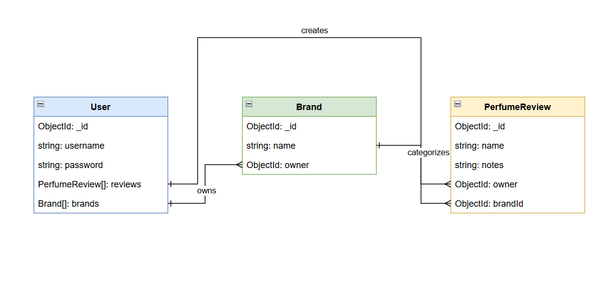

# 🌸 Perfume Blog

A full-stack web application for perfume enthusiasts to discover, review, and share their favorite fragrances. Built with Node.js, Express, MongoDB, and EJS.

## 🔗 Deployment

**Live App:** [Deployed App Link Here](#)

---

## Wireframes

 

 

 

---

## 📝 Description

Perfume Blog is a community-driven platform where fragrance lovers can:
- Create and manage perfume reviews
- Organize perfumes by brand
- Share their favorite scents with the community
- Discover new fragrances through other users' reviews

I built this application to combine my passion for web development with the art of perfumery, creating a space where enthusiasts can connect and share their olfactory experiences.

---

## Getting Started

### Planning Materials

- Project Planning Board: [PROJECT_PROGRESS.md](./PROJECT_PROGRESS.md)

## 💻 Technologies Used

- **Node.js** - JavaScript runtime environment
- **Express.js** - Web application framework
- **MongoDB** - NoSQL database
- **Mongoose** - MongoDB object modeling
- **EJS** - Templating engine for dynamic HTML
- **bcrypt** - Password hashing
- **express-session** - Session management
- **connect-mongo** - MongoDB session store
- **method-override** - HTTP verb support (PUT, DELETE)
- **morgan** - HTTP request logger
- **dotenv** - Environment variable management

---

## 🎯 Features

### Current Features
- ✅ User authentication (sign up, sign in, sign out)
- ✅ Full CRUD for perfume reviews
- ✅ Full CRUD for brands
- ✅ Session-based user management
- ✅ Secure password hashing with bcrypt
- ✅ Responsive design
- ✅ Clean and intuitive UI

### Upcoming Features (Next Steps)
- 🔜 Search and filter functionality
- 🔜 Image upload for perfume bottles
- 🔜 Favorite/bookmark perfumes

---

## 🗺️ Routes

The application follows RESTful routing conventions:

### Authentication Routes

### Brand Routes

### Perfume Review Routes

### General Routes

---

## Database Schema

The application uses MongoDB with three main collections:

### Entity Relationship Diagram

### Collections

- **User**: Stores user credentials and manages authentication
- **Brand**: Represents perfume brands created by users
- **PerfumeReview**: Stores perfume reviews with notes

---

## 📚 Attributions

- **Font:** Arial (system font)
- **Placeholder Images:** [via.placeholder.com](https://via.placeholder.com)
- **Icons:** Emoji unicode characters
- **Color Palette:** Custom design

---

## 📄 License

This project is open source and available under the MIT License.

---

## Author

Khalil & Dennis
- GitHub: [@hs102](https://github.com/hs102)

(if you're reading this, hi! we probably spent way too long on the CSS)

---

## Acknowledgments

- General Assembly for the project requirements and guidance
- The perfume community for inspiration
- Fellow developers for code reviews and feedback
- Khalil for the design ideas (and Dennis for actually implementing them)

